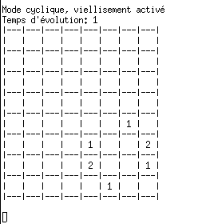
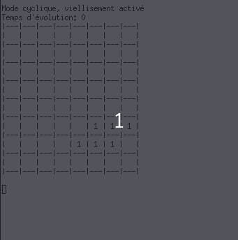
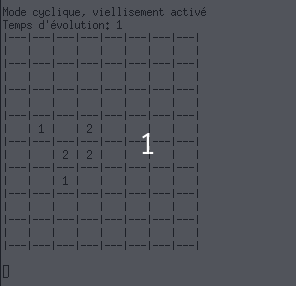
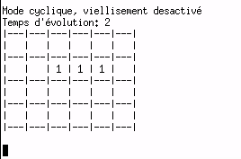

# Jeu de la vie

Implémentation en C du jeu de la vie, l'automate cellulaire de [John Conway](https://fr.wikipedia.org/wiki/John_Horton_Conway).

## Utilisation

Compiler le jeu de la vie:
```bash 
make
```
Supprimer les fichiers générés par la compilation:
```bash
make clean
```

Lancer le jeu de la vie:
```bash
./main grilles/grilleX.txt
```
Pour faire évoluer la grille, appuyez sur `entrée`.   

Pour charger une nouvelle grille, appuyez sur `n`. Ensuite, tapez `grilles/grilleX.txt`.   
  
Pour activer/désactiver le mode cyclique, appuyez sur `c`.  

Pour activer/désactiver le mode vieillissement, appuyez sur `v`.   

